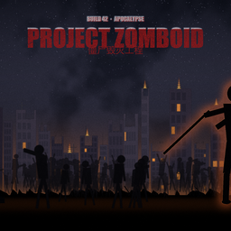

# Zomboid Apocalypse Cover 末世封面 (21:9)

用一张**程序化生成的末世尸潮封面**替换 Project Zomboid Build 42 主菜单的标题背景。



## 为什么需要配套 Lua

引擎（`zombie.gameStates.MainScreenState.renderBackground()`，Build 42.21 字节码）：

```java
if (Core.getInstance().getOptionDoVideoEffects()) { if (renderVideo()) return; }
renderOriginalBackground(1.0f - lightningDelta * 0.6f);
```

* `renderVideo()` 播放 `media/videos/title_screen_background.bik`；
* `doVideoEffects` 的默认值是 **true**（`Core` 构造里 `newOption("doVideoEffects", true)`）。

也就是说：**只把 `Title*.png` 放进 `media/ui/` 是不够的** —— 默认配置下引擎根本不会调用
`renderOriginalBackground()`，视频会把你的图整片盖住。`common/media/lua/shared/` 里的脚本
只做一件事：在载入与进入主菜单时把该选项关掉（**只在本局内存生效，不写 options.ini**）。

## 覆盖了哪些纹理

`renderOriginalBackground()` 只读这 8 个名字，本模组覆盖前 4 个：

| 文件 | 尺寸（本变体） | 引擎绘制方式 |
| --- | --- | --- |
| `Title.png` | 1280x1280 | 左半底图，`(x, 0, w*scale, h*scale)`，`scale = screenHeight/1080` |
| `Title2.png` | 1280x1280 | 右半底图，接在左半右边 |
| `Title3.png` | 1280x1280 | 原版是 1024x56 顶栏条；引擎实际按整幅高绘制，故输出"仅顶部 56 行不透明"的 RGBA |
| `Title4.png` | 1280x1280 | 同上（左右两半） |
| `Title_lightning*.png` | 不提供 | 加法混合（`glBlendFunc(770,1)`），且原版 `lightningDelta` 恒为 0；交回原版最安全 |

画布 2560x1280（1280+1280，带鱼屏铺满、16:9 居中裁掉两侧）。

## 安装

1. 订阅后，游戏内 **Mods** 里启用 `ZomboidTitleCoverWide`；
2. 进入主菜单即可看到新背景。

`incompatible` 已声明：**16:9 与 21:9 两套不要同时启用**（它们写的是同一批文件名，会互相覆盖）。

## 已知限制

* 未在 Linux 上实测（macOS 42.21 + 引擎探针验证）；
* 未做真实工坊上传验证（`workshop.txt` 里 `visibility=private`，发布前自行改 `public`）；
* 若你在「选项 → 视频背景特效」里重新打开为 Yes，标题视频会重新盖住封面（这是引擎行为）；
* 美术是**程序化生成**的（脚本 `tools/make_title_cover.py`，无需联网、可复现）：有意做成
  暗调剪影风格而不是写实渲染图，避免使用任何第三方素材或图库资产。

## 复现美术

```bash
python3 tools/make_title_cover.py           # 生成 base/art 下全部纹理与预览图
python3 tools/make_title_cover.py --check   # 校验尺寸/模式/透明度/非纯色
```
